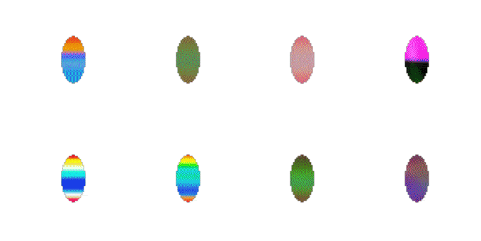

<h1 align="center">Learning Developmental Scaffoldings to Guide Self-Organisation</h1>

<!--
<p align="center">
  <a href=""></a>
  <a href=""></a>
</p>
-->

<p align="center">
  
</p>

Codebase for *Learning Developmental Scaffoldings to Guide Self-Organisation*, which explores the memory-compute trade-off in developmental systems through pre-patterns and neural cellular automata.

Models live in `src/`, training entrypoints in `scripts/`, experiment runners in `bin/`, and figure notebooks in `notebooks/`.

## Setup

Requires Python ≥ 3.13 and [`uv`](https://docs.astral.sh/uv/).

```bash
uv sync
```

JAX is installed with CUDA on Linux and CPU/Metal on macOS automatically.

## Running experiments

The `bin/` scripts wrap the training entrypoints with the hyperparameter sweeps used in the paper. Edit `CUDA_VISIBLE_DEVICES` at the top of each script before running.

```bash
bash bin/run_siren.sh            # SIREN baseline sweep
bash bin/run_ncas.sh             # standard NCA sweep
bash bin/run_pmcas.sh            # SIREN + (invariant) NCA sweep
bash bin/run_growing.sh          # growing PMCA runs
bash bin/run_compression.sh      # capacity / multi-emoji sweep
bash bin/run_noise_robustness.sh # update-probability robustness sweep
```

## Training scripts

To launch a single run directly:

```bash
uv run python -m scripts.train_siren --dataset_name emojis --siren_width 32 --siren_depth 4 ...
uv run python -m scripts.train_nca   --dataset_name emojis --hidden_state 8 ...
uv run python -m scripts.train_pmnca --dataset_name emojis --siren_depth 2 --hidden_state 12 ...
```

Pass `--help` to any script for the full argument list. Logs and checkpoints are written under `--save_folder`.

## Figures

```bash
uv run jupyter lab notebooks/figures.ipynb
```
